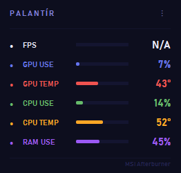
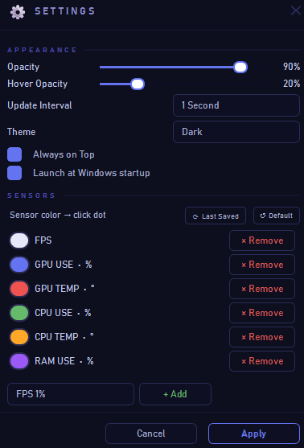

# PALANTÍR

**Lightweight always-on-top hardware monitor overlay for Windows.**
Real-time FPS, GPU/CPU usage, temperatures, power draw, clocks and RAM — right on your screen while gaming or working.

[](https://github.com/thealps01-netizen/palantir/releases/latest)
[](https://python.org)
[](https://github.com/thealps01-netizen/palantir/releases/latest)
[](LICENSE)

---

<div align="center">
  
  &nbsp;&nbsp;&nbsp;
  
</div>

---

## Features

- **Real-time sensor data** via MSI Afterburner shared memory (MAHM)
- **Always-on-top, frameless overlay** — never steals focus from your game (`WS_EX_NOACTIVATE`)
- **Smooth animations** — splash screen on startup, slide-in/out via tray, hover fade, open & close transitions
- **Fully customizable** — per-sensor colors, opacity, hover opacity, poll rate, theme
- **Drag to reposition** or lock in place
- **System tray** integration with right-click context menu
- **Auto-update** — silently checks GitHub Releases on startup and installs updates
- **Windows startup** support via registry
- **Dark & Light themes** with Windows High Contrast accessibility support
- **Rotating logs** + crash handler with detailed reports

---

## Supported Sensors

| Sensor | Unit | Source |
|--------|------|--------|
| FPS / FPS 1% Low | fps | MSI Afterburner |
| GPU Usage / GPU2 Usage | % | MSI Afterburner |
| GPU Temp / GPU Hotspot | °C | MSI Afterburner |
| GPU Power | W | MSI Afterburner |
| GPU Clock / GPU Fan | MHz / rpm | MSI Afterburner |
| VRAM Usage | MB | MSI Afterburner |
| CPU Usage | % | MSI Afterburner |
| CPU Temp | °C | MSI Afterburner |
| CPU Power / CPU Clock | W / MHz | MSI Afterburner |
| RAM Usage | % | Windows API |

---

## Requirements

- **Windows 10 or 11** (64-bit)
- **[MSI Afterburner](https://www.msi.com/Landing/afterburner)** with hardware monitoring enabled

> Palantir reads sensor data from MSI Afterburner's shared memory. Afterburner must be running in the background.

---

## Installation

1. Go to [**Releases**](https://github.com/thealps01-netizen/palantir/releases/latest)
2. Download `Palantir_Setup.exe`
3. Run the installer

> **Windows SmartScreen warning:** You may see "Windows protected your PC" on first run.
> Click **More info → Run anyway**. This is normal for unsigned open-source apps.

---

## Usage

- **Move** — click and drag the overlay
- **Lock** — right-click → Lock (prevents accidental moving)
- **Hide / Show** — left-click the system tray icon (slides in/out with animation)
- **Settings** — click the `⋮` button on the overlay or right-click tray → Settings
- **Quit** — right-click tray → Quit (or right-click overlay → Quit)

### Settings

| Option | Description |
|--------|-------------|
| Opacity | Overlay opacity when idle (10–100%) |
| Hover Opacity | Opacity when mouse is over the overlay |
| Update Interval | Sensor polling rate (250ms – 5s) |
| Theme | Dark or Light |
| Always on Top | Keep overlay above all windows |
| Launch at startup | Start with Windows |
| Sensor colors | Click any colored dot to change that sensor's color |
| Add / Remove sensors | Customize which sensors are displayed |

---

## Developer Setup

```bash
git clone https://github.com/thealps01-netizen/palantir.git
cd palantir
pip install -r requirements.txt
python palantir.py
```

### Run Tests

```bash
pip install -r requirements-dev.txt
pytest tests/
```

---

## Build

Requires [PyInstaller](https://pyinstaller.org) and [Inno Setup 6](https://jrsoftware.org/isinfo.php).

```bash
build.bat
```

Produces `installer/Palantir_Setup.exe` — a self-contained Windows installer.

---

## Project Structure

| File | Description |
|------|-------------|
| `palantir.py` | Main UI widget, splash screen, animations, entry point |
| `hw.py` | Hardware data sources — MAHM shared memory + Windows API |
| `cfg.py` | Sensor catalog, settings persistence, startup registry |
| `themes.py` | QSS theme builders — dark, light, high contrast |
| `dialogs.py` | Settings dialog, welcome screen |
| `updater.py` | GitHub Releases update checker and auto-installer |
| `logger.py` | Rotating file logger |
| `crash_handler.py` | Global exception handler with crash reports |
| `version.py` | Single source of truth for version |
| `build.bat` | Build automation (PyInstaller → Inno Setup) |
| `palantir.iss` | Inno Setup installer configuration |

---

## Logs

Stored in `%LOCALAPPDATA%\Palantir\logs\`:

| File | Description |
|------|-------------|
| `palantir.log` | Application log — 1 MB rotating, 2 backups |
| `crash_YYYYMMDD_HHMMSS.log` | Crash reports with full traceback |

---

## License

[MIT](LICENSE) © 2026 thealps01-netizen
